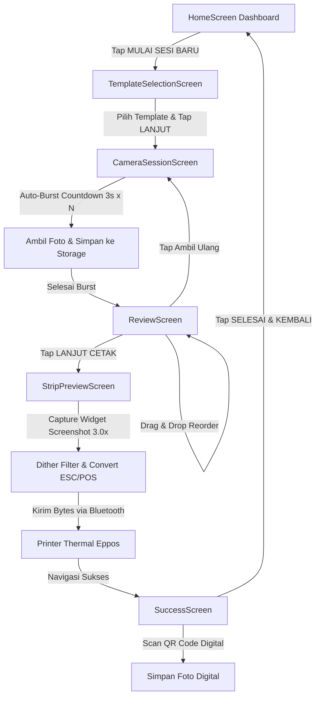
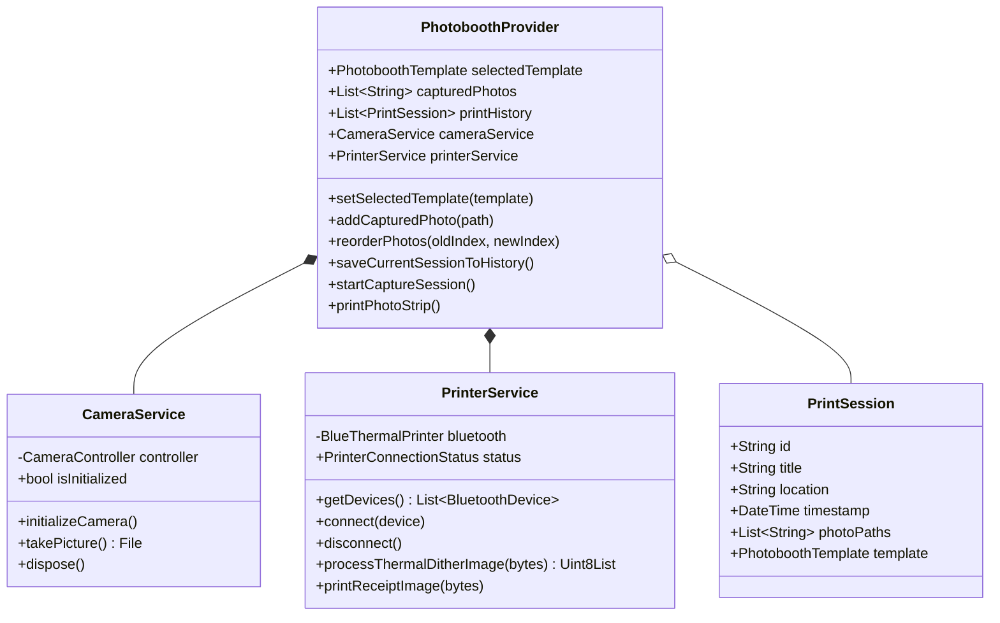
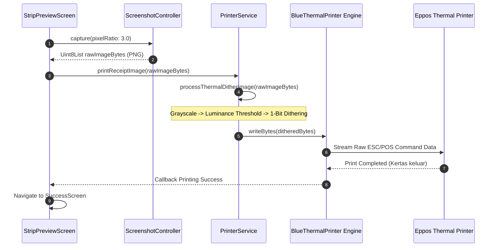

# 📸 EPPOS BOOTH — Retro Arcade Thermal Photobooth App

[](https://flutter.dev)
[](https://dart.dev)
[](https://pub.dev/packages/provider)
[](https://flutter.dev)
[](https://pub.dev/packages/blue_thermal_printer)

**EPPOS BOOTH** adalah aplikasi *photobooth* mobile modern dengan estetika gabungan **Retro 3D Arcade** dan **Digital Thermal Receipt**. Aplikasi ini memungkinkan pengguna untuk mengambil rangkaian foto *auto-burst*, menyusun tata letak kanvas, melihat pratinjau efek cetak thermal 1-bit, mencetak hasil foto secara langsung melalui koneksi Bluetooth ke printer thermal **Eppos (58mm/80mm)**, serta menyimpan versi digital menggunakan **QR Code**.

---

## 📌 Daftar Isi
- [✨ Fitur Utama](#-fitur-utama)
- [🎨 Design System & Aesthetics](#-design-system--aesthetics)
- [🏗 Architecture & Workflow (Diagram Mermaid)](#-architecture--workflow-diagram-mermaid)
  - [1. User Journey & Screen Flow](#1-user-journey--screen-flow)
  - [2. Service & Provider Architecture](#2-service--provider-architecture)
  - [3. Thermal Print Pipeline](#3-thermal-print-pipeline)
- [🛠 Tech Stack & Dependencies](#-tech-stack--dependencies)
- [📂 Struktur Folder Project](#-struktur-folder-project)
- [🚀 Panduan Setup & Instalasi](#-panduan-setup--instalasi)
- [printer Setup Printer Bluetooth Eppos](#-setup-printer-bluetooth-eppos)
- [🔒 Izin Perangkat (Permissions)](#-izin-perangkat-permissions)

---

## ✨ Fitur Utama

1. **Multi-Template Layout Selection (Step 1)**:
   - **Classic Strip**: Format 4 foto vertikal klasik photobooth.
   - **Square Grid**: Format 4 foto kotak presisi.
   - **Bento Style**: Layout 3 foto asimetris modern.

2. **Camera Hardware & Auto-Burst Engine (Step 2)**:
   - Integrasi kamera depan (*front-facing camera*) resolusi tinggi.
   - Tampilan overlay angka hitung mundur *auto-burst* raksasa (**120px** green monospace neon) di atas feed kamera.
   - Animasi *white flash shutter* saat jepretan diambil.
   - Indikator kemajuan jepretan dinamis (*Photo 1 / 4*, *Photo 2 / 4*).

3. **Drag-and-Drop Review & 1-Bit Thermal Filter (Step 3)**:
   - Urutkan posisi foto hasil jepretan dengan gerakan sentuh *drag-and-drop* (`ReorderableListView`).
   - Pratinjau langsung filter efek hitam-putih kontras tinggi (*1-bit grayscale matrix*) menyerupai hasil cetakan kertas thermal.
   - Opsi *"Ambil Ulang"* untuk menghapus sesi dan kembali ke kamera.

4. **Skeuomorphic Print Preview (Step 4)**:
   - Visualisasi realistis kertas nota thermal yang keluar berulur dari celah mesin cetak berbahan krom metalik (*skeuomorphic metallic slot*).
   - Render teks header monospace (*EPPOS BOOTH*, timestamp lokasi & waktu real).
   - Barcode pixelated 8-bit & pesan penutup (*"Thank you for playing!"*).

5. **Thermal Print Engine & Bluetooth ESC/POS**:
   - Konversi elemen UI struk nota ke dalam array byte gambar resolusi tinggi (`Screenshot` widget dengan `pixelRatio: 3.0`).
   - Filter *luminance threshold & dithering* agar gambar foto tercetak tajam tanpa buram pada kertas thermal hitam-putih.
   - Pengiriman byte stream ke printer Bluetooth **Eppos 58mm/80mm**.

6. **Digital Share & Real QR Code Generator (Step 5)**:
   - Generasi UUID unik untuk setiap sesi photobooth (`https://eppos.app/session/<uuid>`).
   - Tampilan **QR Code** interaktif (`QrImageView`) berwarna hijau tua kontras tinggi lengkap dengan animasi *laser scanner line*.

7. **Riwayat Cetak & Galeri Foto Real**:
   - Penyimpanan otomatis riwayat cetak (*PrintSession*) ke memori internal perangkat (`path_provider`).
   - Tab Galeri Foto dan Tab Riwayat Cetak pada dashboard utama.

---

## 🎨 Design System & Aesthetics

Aplikasi dirancang dengan **Strict Design Rules**:
- **Scaffold Background**: Warm off-white (`Color(0xFFE5E7EB)` / `Color(0xFFF4F4F5)`). Bebas warna putih polos dominan.
- **Card Surfaces**: Pure White (`Color(0xFFFFFFFF)`).
- **Typography**: `Inter` untuk UI umum & `JetBrains Mono` untuk teks thermal receipt/nota.
- **Primary Accent**: Emerald Green (`Color(0xFF16A34A)` / `Color(0xFF10B981)`).
- **3D Arcade Button Effect**: Tombol hijau berkesan 3D fisik dengan batas kedalaman bawah solid (*depth shadow offset*) yang memberikan respon taktil saat ditekan.
- **Scalloped Edge Divider**: Garis gerigi potong struk nota pada bagian bawah kertas.

---

## 🏗 Architecture & Workflow (Diagram Mermaid)

### 1. User Journey & Screen Flow



---

### 2. Service & Provider Architecture



---

### 3. Thermal Print Pipeline



---

## 🛠 Tech Stack & Dependencies

| Category | Package / Tool | Kegunaan |
| :--- | :--- | :--- |
| **Framework** | `Flutter (Dart 3.x)` | Cross-platform Mobile App Framework |
| **State Management** | `provider: ^6.1.2` | Global App State Management |
| **Typography** | `google_fonts: ^6.2.1` | Font Inter & JetBrains Mono |
| **Hardware Camera** | `camera: ^0.11.0+2` | Kontrol kamera depan & jepretan foto |
| **Thermal Printing** | `blue_thermal_printer: ^1.2.3` | Koneksi Bluetooth & ESC/POS byte streaming |
| **Image Dithering** | `image: ^4.3.0` | Pemrosesan thresholding 1-bit & dithering gambar |
| **Widget Screenshot** | `screenshot: ^3.0.0` | Konversi UI widget nota ke PNG byte array |
| **QR Code** | `qr_flutter: ^4.1.0` | Render QR Code SVG/Canvas digital share |
| **Permissions** | `permission_handler: ^11.3.1` | Penanganan izin Kamera, Mikrofon & Bluetooth |
| **Storage & Utils** | `path_provider: ^2.1.4` | Akses direktori aplikasi perangkat |
| **Formatting & UUID** | `intl: ^0.19.0`, `uuid: ^4.5.1` | Format tanggal & UUID generator sesi |

---

## 📂 Struktur Folder Project

```text
lib/
├── main.dart                       # Entry point aplikasi & MultiProvider setup
├── providers/
│   └── photobooth_provider.dart    # Central State Management (Template, Photos, History)
├── services/
│   ├── camera_service.dart         # Service kontrol kamera & simpan file lokal
│   └── printer_service.dart        # Service Bluetooth scanner & thermal print dithering
├── theme/
│   ├── app_colors.dart             # Token warna design system
│   └── app_theme.dart              # Material ThemeData global & TextStyle helpers
├── screens/
│   ├── home_screen.dart            # Dashboard Utama (IndexedStack 4 Tabs & 3D Hero CTA)
│   ├── template_selection_screen.dart # Step 1: Pilih Layout Kanvas (Classic/Square/Bento)
│   ├── camera_session_screen.dart  # Step 2: Viewfinder Kamera & Auto-Burst Engine
│   ├── review_screen.dart          # Step 3: Reordering Drag-and-Drop & Filter Grayscale
│   ├── strip_preview_screen.dart   # Step 4: Pratinjau Cetak Skeuomorphic & Capture
│   ├── success_screen.dart         # Step 5: Tampilan Sukses & Digital Share QR Code
│   └── printer_settings_screen.dart# Pengaturan Koneksi Printer Bluetooth Eppos
└── widgets/
    ├── animated_button.dart        # Widget Tombol Arcade 3D
    ├── custom_toggle_switch.dart   # Toggle Custom (Blue Checkmark Thumb)
    └── thermal_photo_strip.dart    # Widget Kertas Nota Thermal
```

---

## 🚀 Panduan Setup & Instalasi

### 1. Prasyarat System
- **Flutter SDK**: v3.19.0 atau yang lebih baru.
- **Dart SDK**: v3.3.0 atau yang lebih baru.
- **Xcode** (untuk iOS) / **Android Studio** (untuk Android).
- **Physical Device**: Disarankan menggunakan HP fisik untuk menguji Kamera & Bluetooth Printer.

### 2. Langkah Instalasi

1. Clone repositori ini ke komputer Anda:
   ```bash
   git clone https://github.com/username/eppos_photobooth.git
   cd eppos_photobooth
   ```

2. Install seluruh dependensi package:
   ```bash
   flutter pub get
   ```

3. Jalankan aplikasi pada perangkat Android / iOS:
   ```bash
   flutter run
   ```

---

## 🖨️ Setup Printer Bluetooth Eppos

1. Nyalakan printer thermal **Eppos** (contoh: *EPPOS EPP-5802* atau *EPP-8001*).
2. Buka Pengaturan Bluetooth pada HP Android/iOS Anda, kemudian pasangkan (*Pair*) printer Eppos (PIN default umum: `0000` atau `1234`).
3. Buka aplikasi **EPPOS BOOTH**, masuk ke tab **Pengaturan** (ikon roda gigi di navigasi bawah).
4. Tekan tombol **"Pindai & Hubungkan Printer"**.
5. Pilih nama printer Eppos Anda dari daftar modal bottom sheet.
6. Indikator status akan berubah menjadi **"Terhubung"** (badge hijau).

---

## 🔒 Izin Perangkat (Permissions)

Aplikasi ini membutuhkan izin berikut yang sudah dikonfigurasi pada file platform native:

### Android (`android/app/src/main/AndroidManifest.xml`)
- `android.permission.CAMERA`
- `android.permission.RECORD_AUDIO`
- `android.permission.BLUETOOTH`
- `android.permission.BLUETOOTH_ADMIN`
- `android.permission.BLUETOOTH_SCAN`
- `android.permission.BLUETOOTH_CONNECT`
- `android.permission.ACCESS_FINE_LOCATION`

### iOS (`ios/Runner/Info.plist`)
- `NSCameraUsageDescription`: *"Aplikasi membutuhkan akses kamera untuk mengambil foto photobooth."*
- `NSMicrophoneUsageDescription`: *"Aplikasi membutuhkan akses mikrofon."*
- `NSBluetoothAlwaysUsageDescription`: *"Aplikasi membutuhkan Bluetooth untuk menghubungkan printer thermal Eppos."*
- `NSBluetoothPeripheralUsageDescription`: *"Aplikasi membutuhkan Bluetooth."*

---

<p center="align">
  Crafted with ❤️ for Eppos Thermal Photobooth Experience.
</p>
